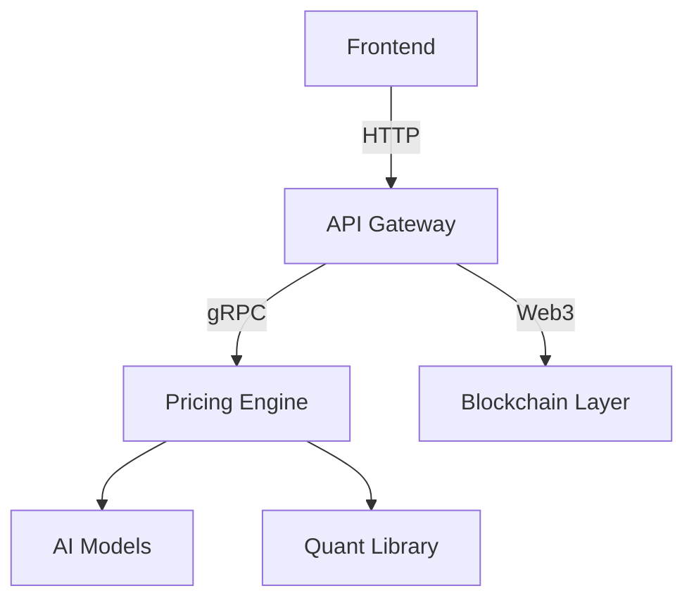

# Decentralized Derivatives Trading Platform  
[](https://opensource.org/licenses/MIT)  
[](https://github.com/your-org/derivatives-platform/actions)  

## 📜 Overview  
Blockchain-based platform for trading futures/options contracts with AI-powered risk management and quantitative pricing models.  

## 🚀 Features  
- On-chain execution of derivatives contracts  
- Black-Scholes + Monte Carlo pricing engine  
- LSTM volatility forecasting (30-day predictions)  
- Chainlink-powered auto-liquidation system  
- Institutional risk metrics (VaR, Greeks)  
- Multi-chain deployment (Ethereum/Polygon/Arbitrum)  
- Interactive D3.js analytics dashboard  
- Kubernetes-managed microservices  
- Terraform infrastructure-as-code  
- CI/CD with GitHub Actions  

## 🛠️ Tech Stack  
**Blockchain**: Solidity, Chainlink, Truffle, web3.js  
**Backend**: Python, FastAPI, NumPy, SciPy  
**AI/ML**: TensorFlow, Keras, Pandas  
**Frontend**: React, D3.js, Ethers.js  
**Database**: PostgreSQL, TimescaleDB  
**Infra**: Docker, AWS EKS, Terraform  

## 🏗️ Architecture  


## ⚙️ Installation  
```bash
git clone https://github.com/your-org/derivatives-platform.git  
cd derivatives-platform  
docker-compose up -d postgres redis  # Start dependencies  
cd blockchain && truffle migrate --network mainnet  # Deploy contracts  
cd ../backend && uvicorn app:app --reload  # Start API  
cd ../frontend && npm start  # Launch frontend  
```
