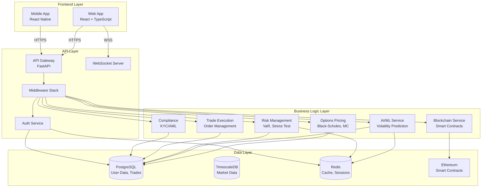

# Architecture Overview

Comprehensive architecture documentation for the Optionix platform.

## Table of Contents

- [System Architecture](#system-architecture)
- [Component Diagram](#component-diagram)
- [Data Flow](#data-flow)
- [Technology Stack](#technology-stack)
- [Module Mapping](#module-mapping)
- [Database Schema](#database-schema)
- [API Architecture](#api-architecture)
- [Security Architecture](#security-architecture)
- [Deployment Architecture](#deployment-architecture)

## System Architecture

Optionix is built using a modern microservices architecture with the following design principles:

- **Separation of Concerns**: Each component has a single, well-defined responsibility
- **Scalability**: Horizontal scaling for all stateless services
- **Resilience**: Circuit breakers, retries, and graceful degradation
- **Security**: Defense in depth with multiple security layers
- **Observability**: Comprehensive logging, metrics, and tracing

### High-Level Architecture

```
┌─────────────────────────────────────────────────────────────────────┐
│                          Client Layer                                │
│  ┌──────────────┐  ┌──────────────┐  ┌──────────────┐              │
│  │ Web Browser  │  │ Mobile App   │  │ API Clients  │              │
│  │  (React)     │  │(React Native)│  │  (External)  │              │
│  └──────┬───────┘  └──────┬───────┘  └──────┬───────┘              │
└─────────┼──────────────────┼──────────────────┼─────────────────────┘
          │                  │                  │
          └──────────────────┼──────────────────┘
                             │
                    ┌────────▼────────┐
                    │   API Gateway   │
                    │  (Load Balancer)│
                    └────────┬────────┘
                             │
┌────────────────────────────┼────────────────────────────────────────┐
│                     Application Layer                                │
│            ┌────────────────┴────────────────┐                       │
│            │                                  │                       │
│   ┌────────▼─────────┐            ┌─────────▼────────┐              │
│   │  Backend API     │◄──────────►│  WebSocket       │              │
│   │  (FastAPI)       │            │  Server          │              │
│   └────────┬─────────┘            └─────────┬────────┘              │
│            │                                 │                        │
│            └─────────────┬───────────────────┘                        │
│                          │                                            │
│         ┌────────────────┼────────────────┐                          │
│         │                │                │                          │
│  ┌──────▼──────┐  ┌─────▼─────┐  ┌───────▼────────┐                │
│  │ Options     │  │ AI/ML      │  │ Blockchain     │                │
│  │ Pricing     │  │ Models     │  │ Service        │                │
│  │ Engine      │  │ Service    │  │                │                │
│  └──────┬──────┘  └─────┬─────┘  └───────┬────────┘                │
└─────────┼────────────────┼─────────────────┼────────────────────────┘
          │                │                 │
          │                │                 │
┌─────────┼────────────────┼─────────────────┼────────────────────────┐
│                     Data Layer                                       │
│         │                │                 │                          │
│  ┌──────▼──────┐  ┌─────▼─────┐  ┌───────▼────────┐                │
│  │ PostgreSQL  │  │  Redis    │  │  Ethereum      │                │
│  │ (Primary)   │  │  (Cache)  │  │  Blockchain    │                │
│  │ TimescaleDB │  │           │  │                │                │
│  └─────────────┘  └───────────┘  └────────────────┘                │
└──────────────────────────────────────────────────────────────────────┘
```

## Component Diagram

### Detailed Component Architecture



## Data Flow

### Request Flow

```
1. Client Request
   ↓
2. API Gateway (Rate Limiting, Load Balancing)
   ↓
3. Security Middleware (Authentication, Authorization)
   ↓
4. Request Validation Middleware
   ↓
5. Business Logic (Service Layer)
   ↓
6. Data Access Layer
   ↓
7. Database / External Services
   ↓
8. Response Processing
   ↓
9. Audit Logging Middleware
   ↓
10. Client Response
```

### Options Pricing Flow

```
User → Frontend → API (/options/price)
         ↓
    Validate Parameters
         ↓
    Pricing Engine Service
         ↓
    ┌────────┴────────┐
    │                 │
Black-Scholes      Monte Carlo
    │                 │
    └────────┬────────┘
         ↓
    Calculate Greeks
         ↓
    Cache Result (Redis)
         ↓
    Store in DB
         ↓
    Return to Client
```

### AI Prediction Flow

```
Market Data → Preprocessing
         ↓
    Feature Engineering
         ↓
    Load Model (cache if available)
         ↓
    Run Inference
         ↓
    Post-processing
         ↓
    Store Prediction
         ↓
    Return Result + Confidence
```

## Technology Stack

### Backend Stack

```
┌─────────────────────────────────────────┐
│          Application Framework          │
│  • FastAPI 0.104+                       │
│  • Uvicorn (ASGI Server)                │
│  • Starlette (Core)                     │
└─────────────────────────────────────────┘
┌─────────────────────────────────────────┐
│          Business Logic                 │
│  • NumPy, SciPy (Scientific Computing)  │
│  • Pandas (Data Processing)             │
│  • PyTorch, TensorFlow (ML)             │
│  • scikit-learn (ML)                    │
└─────────────────────────────────────────┘
┌─────────────────────────────────────────┐
│          Data Access                    │
│  • SQLAlchemy 2.0 (ORM)                 │
│  • Alembic (Migrations)                 │
│  • asyncpg (PostgreSQL Driver)          │
│  • aioredis (Redis Client)              │
│  • Web3.py (Blockchain)                 │
└─────────────────────────────────────────┘
```

### Frontend Stack

```
┌─────────────────────────────────────────┐
│          Web Framework                  │
│  • React 18+                            │
│  • TypeScript 5+                        │
│  • Redux Toolkit (State)                │
│  • React Router (Navigation)            │
└─────────────────────────────────────────┘
┌─────────────────────────────────────────┐
│          UI Components                  │
│  • TailwindCSS (Styling)                │
│  • Styled Components                    │
│  • D3.js (Data Visualization)           │
│  • TradingView Charts                   │
└─────────────────────────────────────────┘
┌─────────────────────────────────────────┐
│          Build Tools                    │
│  • Webpack/Vite (Bundler)               │
│  • Babel (Transpiler)                   │
│  • ESLint, Prettier (Linting)           │
└─────────────────────────────────────────┘
```

## Module Mapping

### Backend Module Structure

| Module                  | File Path                             | Responsibility                               | Dependencies          |
| ----------------------- | ------------------------------------- | -------------------------------------------- | --------------------- |
| **Application Entry**   | `code/backend/app.py`                 | FastAPI app initialization, middleware setup | FastAPI, all services |
| **Authentication**      | `code/backend/auth.py`                | JWT auth, user management, MFA               | jose, passlib, pyotp  |
| **Configuration**       | `code/backend/config.py`              | Environment config, settings                 | pydantic-settings     |
| **Database**            | `code/backend/database.py`            | DB connection, session management            | SQLAlchemy            |
| **Models**              | `code/backend/models.py`              | ORM models, database schema                  | SQLAlchemy            |
| **Schemas**             | `code/backend/schemas.py`             | Pydantic schemas, validation                 | Pydantic              |
| **Security**            | `code/backend/security.py`            | Security utilities, encryption               | cryptography          |
| **Data Protection**     | `code/backend/data_protection.py`     | GDPR compliance, data handling               | SQLAlchemy            |
| **Compliance**          | `code/backend/compliance.py`          | KYC/AML, regulatory compliance               | -                     |
| **Financial Standards** | `code/backend/financial_standards.py` | Financial regulations (SOX, MiFID II)        | -                     |

### Service Layer Modules

| Service                | File Path                                                   | Responsibility              | API Endpoints                 |
| ---------------------- | ----------------------------------------------------------- | --------------------------- | ----------------------------- |
| **Pricing Engine**     | `code/backend/services/pricing_engine.py`                   | Option pricing calculations | `POST /options/price`         |
| **Model Service**      | `code/backend/services/model_service.py`                    | AI model inference          | `POST /market/volatility`     |
| **Blockchain Service** | `code/backend/services/blockchain_service.py`               | Smart contract interaction  | `POST /blockchain/contract/*` |
| **Financial Service**  | `code/backend/services/financial_service.py`                | Financial calculations      | Various                       |
| **Risk Assessment**    | `code/backend/services/risk_assessment.py`                  | VaR, stress testing         | `POST /risk/*`                |
| **Risk Engine**        | `code/backend/services/risk_management/risk_engine.py`      | Risk limits, margin         | Internal                      |
| **Execution Engine**   | `code/backend/services/trade_execution/execution_engine.py` | Order execution             | `POST /trade/execute`         |
| **Circuit Breaker**    | `code/backend/services/trade_execution/circuit_breaker.py`  | Trading halts               | Internal                      |
| **Compliance Service** | `code/backend/services/compliance_service.py`               | Compliance checks           | Internal                      |

### Quantitative Library

| Module                    | File Path                                             | Functionality                    | Key Classes/Functions  |
| ------------------------- | ----------------------------------------------------- | -------------------------------- | ---------------------- |
| **Black-Scholes**         | `code/quantitative/black_scholes.py`                  | European/American option pricing | `BlackScholesModel`    |
| **Monte Carlo**           | `code/quantitative/monte_carlo.py`                    | Path-dependent options           | `MonteCarloSimulator`  |
| **Volatility Surface**    | `code/quantitative/advanced/volatility_surface.py`    | Vol surface construction         | `VolatilitySurface`    |
| **Local Volatility**      | `code/quantitative/advanced/local_volatility.py`      | Dupire local vol                 | `LocalVolatilityModel` |
| **Stochastic Volatility** | `code/quantitative/advanced/stochastic_volatility.py` | Heston model                     | `HestonModel`          |
| **Calibration**           | `code/quantitative/advanced/calibration_engine.py`    | Model calibration                | `CalibrationEngine`    |

### Middleware Stack

| Middleware             | File Path                                  | Functionality         | Order |
| ---------------------- | ------------------------------------------ | --------------------- | ----- |
| **Security Headers**   | `code/backend/middleware/security.py`      | HTTP security headers | 1st   |
| **Rate Limiting**      | `code/backend/middleware/rate_limiting.py` | API rate limiting     | 2nd   |
| **Request Validation** | `code/backend/middleware/security.py`      | Input validation      | 3rd   |
| **Audit Logging**      | `code/backend/middleware/audit_logging.py` | Audit trail           | Last  |

## Database Schema

### Core Tables

```sql
-- Users and Authentication
users
├── id (UUID, PK)
├── email (VARCHAR, UNIQUE)
├── hashed_password (VARCHAR)
├── full_name (VARCHAR)
├── role (ENUM)
├── kyc_status (ENUM)
├── mfa_enabled (BOOLEAN)
├── created_at (TIMESTAMP)
└── last_login (TIMESTAMP)

-- Trading Positions
positions
├── id (UUID, PK)
├── user_id (UUID, FK → users.id)
├── symbol (VARCHAR)
├── option_type (ENUM)
├── strike_price (DECIMAL)
├── expiration_date (DATE)
├── quantity (DECIMAL)
├── entry_price (DECIMAL)
├── current_price (DECIMAL)
└── created_at (TIMESTAMP)

-- Market Data (TimescaleDB Hypertable)
market_data
├── timestamp (TIMESTAMP, PK)
├── symbol (VARCHAR, PK)
├── price (DECIMAL)
├── volume (BIGINT)
├── bid (DECIMAL)
├── ask (DECIMAL)
└── implied_volatility (DECIMAL)

-- Trade History
trades
├── id (UUID, PK)
├── user_id (UUID, FK → users.id)
├── position_id (UUID, FK → positions.id)
├── trade_type (ENUM: open, close, exercise)
├── quantity (DECIMAL)
├── price (DECIMAL)
├── fee (DECIMAL)
├── timestamp (TIMESTAMP)
└── blockchain_tx_hash (VARCHAR, NULLABLE)

-- Audit Logs
audit_logs
├── id (UUID, PK)
├── user_id (UUID, FK → users.id)
├── action (VARCHAR)
├── resource (VARCHAR)
├── details (JSONB)
├── ip_address (INET)
├── user_agent (VARCHAR)
└── timestamp (TIMESTAMP)
```

### Relationships

```
users 1──N positions
users 1──N trades
positions 1──N trades
users 1──N audit_logs
```

## API Architecture

### RESTful API Design

- **Resource-Based URLs**: `/options/price`, `/portfolio/positions`
- **HTTP Methods**: GET (read), POST (create), PUT/PATCH (update), DELETE (remove)
- **Status Codes**: 200 (OK), 201 (Created), 400 (Bad Request), 401 (Unauthorized), 404 (Not Found), 500 (Server Error)
- **JSON Format**: All requests and responses in JSON
- **Versioning**: URL-based versioning (`/api/v2/`)

### API Layers

```
┌─────────────────────────────────┐
│     Route Handlers              │ ← FastAPI endpoints
├─────────────────────────────────┤
│     Service Layer               │ ← Business logic
├─────────────────────────────────┤
│     Repository Layer            │ ← Data access
├─────────────────────────────────┤
│     ORM / Database              │ ← SQLAlchemy
└─────────────────────────────────┘
```

## Security Architecture

### Security Layers

```
┌──────────────────────────────────────────┐
│  1. Network Security                     │
│     • HTTPS/TLS                          │
│     • Firewall Rules                     │
│     • DDoS Protection                    │
├──────────────────────────────────────────┤
│  2. Authentication & Authorization       │
│     • JWT Tokens                         │
│     • MFA (TOTP)                         │
│     • RBAC                               │
├──────────────────────────────────────────┤
│  3. Input Validation                     │
│     • Pydantic Schemas                   │
│     • SQL Injection Prevention           │
│     • XSS Prevention                     │
├──────────────────────────────────────────┤
│  4. Data Protection                      │
│     • Encryption at Rest (AES-256)       │
│     • Encryption in Transit (TLS 1.3)    │
│     • Key Management                     │
├──────────────────────────────────────────┤
│  5. Application Security                 │
│     • Rate Limiting                      │
│     • Session Management                 │
│     • CSRF Protection                    │
├──────────────────────────────────────────┤
│  6. Monitoring & Auditing                │
│     • Audit Logs                         │
│     • Intrusion Detection                │
│     • Security Alerts                    │
└──────────────────────────────────────────┘
```

## Deployment Architecture

### Production Deployment

```
┌──────────────────────────────────────────────────┐
│              Internet                             │
└────────────────────┬─────────────────────────────┘
                     │
            ┌────────▼────────┐
            │  CloudFlare CDN │
            │  & WAF          │
            └────────┬────────┘
                     │
┌────────────────────┼──────────────────────────────┐
│                    │   Kubernetes Cluster         │
│          ┌─────────▼────────┐                     │
│          │  Ingress NGINX   │                     │
│          └─────────┬────────┘                     │
│                    │                               │
│     ┌──────────────┼──────────────┐               │
│     │              │               │               │
│ ┌───▼────┐    ┌───▼────┐     ┌───▼────┐          │
│ │Backend │    │Backend │     │Backend │          │
│ │Pod 1   │    │Pod 2   │     │Pod 3   │          │
│ └────────┘    └────────┘     └────────┘          │
│     │              │               │               │
│     └──────────────┼───────────────┘               │
│                    │                               │
│     ┌──────────────┼──────────────┐               │
│     │              │               │               │
│ ┌───▼────────┐ ┌──▼──────────┐ ┌─▼────────────┐  │
│ │PostgreSQL  │ │   Redis     │ │  Prometheus  │  │
│ │StatefulSet │ │ StatefulSet │ │  & Grafana   │  │
│ └────────────┘ └─────────────┘ └──────────────┘  │
└───────────────────────────────────────────────────┘
```

### Container Architecture

```
┌─────────────────────────────────────┐
│      Docker Container               │
│  ┌───────────────────────────────┐  │
│  │  Application (FastAPI)        │  │
│  ├───────────────────────────────┤  │
│  │  Python 3.11 Runtime          │  │
│  ├───────────────────────────────┤  │
│  │  Dependencies (pip packages)  │  │
│  ├───────────────────────────────┤  │
│  │  Configuration                │  │
│  └───────────────────────────────┘  │
│  Base Image: python:3.11-slim       │
└─────────────────────────────────────┘
```

## Scalability Considerations

### Horizontal Scaling

- **Stateless Backend**: All backend services are stateless, allowing infinite horizontal scaling
- **Session Storage**: Redis-backed sessions for distributed deployment
- **Database Connection Pooling**: Efficient connection reuse
- **Load Balancing**: Round-robin or least-connections algorithm

### Vertical Scaling

- **Resource Limits**: CPU and memory limits per pod
- **Auto-scaling**: Kubernetes HPA based on CPU/memory usage
- **Database Optimization**: Indexes, query optimization, read replicas

### Caching Strategy

```
Request → Check Redis Cache
            │
            ├─ Cache Hit → Return Cached Data
            │
            └─ Cache Miss → Query Database
                             ↓
                        Store in Cache
                             ↓
                        Return Data
```

## Performance Optimization

1. **Database**: Indexes on frequently queried fields, connection pooling
2. **Caching**: Redis for sessions, API responses, model predictions
3. **Async I/O**: FastAPI async endpoints for concurrent request handling
4. **CDN**: Static assets served via CDN
5. **Compression**: gzip compression for API responses
6. **Query Optimization**: Efficient SQL queries, eager loading

## Monitoring & Observability

```
┌─────────────────────────────────────────┐
│           Application                    │
│  ┌─────────────────────────────────┐    │
│  │  Metrics (Prometheus)           │    │
│  │  • Request rate                 │    │
│  │  • Response time                │    │
│  │  • Error rate                   │    │
│  └─────────────────────────────────┘    │
│  ┌─────────────────────────────────┐    │
│  │  Logs (ELK Stack)               │    │
│  │  • Application logs             │    │
│  │  • Audit logs                   │    │
│  │  • Error logs                   │    │
│  └─────────────────────────────────┘    │
│  ┌─────────────────────────────────┐    │
│  │  Traces (Jaeger/OpenTelemetry)  │    │
│  │  • Request tracing              │    │
│  │  • Service dependencies         │    │
│  └─────────────────────────────────┘    │
└─────────────────────────────────────────┘
```

## Next Steps

- [Feature Matrix](FEATURE_MATRIX.md) - Complete feature list
- [API Reference](API.md) - API documentation
- [Usage Guide](USAGE.md) - How to use the system

---
